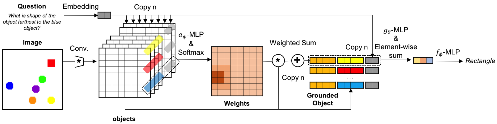

# SARN: Sequential Attention Relational Network
This is Pytorch implementation of our work ["SARN: Relational Reasoning through Sequential Attention
"](https://arxiv.org/abs/1811.00246).

We tried to solve exploding relations(quadratic) problem of Relational Network module by paying attention sequentially.

# Requirements
- Pytorch 0.4

# Benchmarks
## Baseline
```
python main.py --model baseline
```
## Relational Network
```
python main.py --model rn
```
## FILM
```
python main.py --model film
```
## SARN
```
python main.py --model sarn
```
## SARN att(Work in progress)
```
python main.py --model sarn_att
```

# Results
Results of benchmarks with varying size of image and objects on modified Sort-Of-Clevr dataset. 
|   model  | image - object | 64 - 4 | 64 - 5 | 75 - 5 | 128 - 4 | 128 - 5 | 128 - 8 | 128 - 16 |
|:--------:|:--------------:|:------:|:------:|:------:|:-------:|:-------:|:-------:|:--------:|
| baseline |     non-rel    | 0.9941 | 0.9933 | 0.9961 |  0.9883 |  0.9978 |  0.9883 |     -    |
| baseline |       rel      |  0.812 | 0.8163 | 0.8205 |  0.7227 |  0.8532 |  0.7227 |     -    |
| baseline |      total     | 0.8803 | 0.8827 | 0.8864 |  0.8223 |  0.9074 |  0.8223 |     -    |
|    rn    |     non-rel    | 0.9944 | 0.9964 | 0.9961 |  0.9922 |  0.9931 |  0.9922 |  0.9719  |
|    rn    |       rel      | 0.8415 |  0.843 | 0.8517 |  0.826  |  0.7719 |  0.826  |  0.7708  |
|    rn    |      total     | 0.8989 | 0.9005 | 0.9058 |  0.8883 |  0.8555 |  0.8883 |  0.8462  |
|   sarn   |     non-rel    |  0.997 | 0.9948 | 0.9986 |  0.9992 |  0.9988 |  0.9992 |  0.9819  |
|   sarn   |       rel      | 0.8949 |  0.837 |   0.9  |  0.931  |  0.8669 |  0.931  |  0.8533  |
|   sarn   |      total     | 0.9345 |  0.897 | 0.9347 |  0.9566 |  0.9163 |  0.9566 |  0.9016  |

# Reference
- MHDPA: https://github.com/jadore801120/attention-is-all-you-need-pytorch
